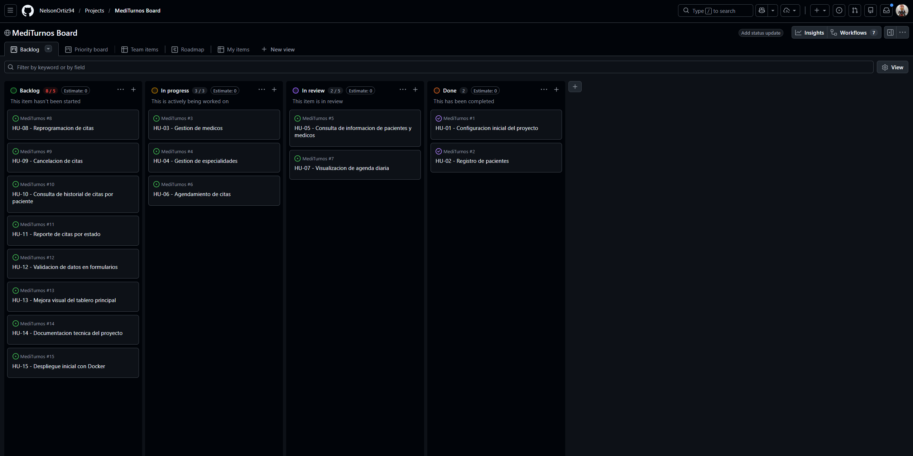
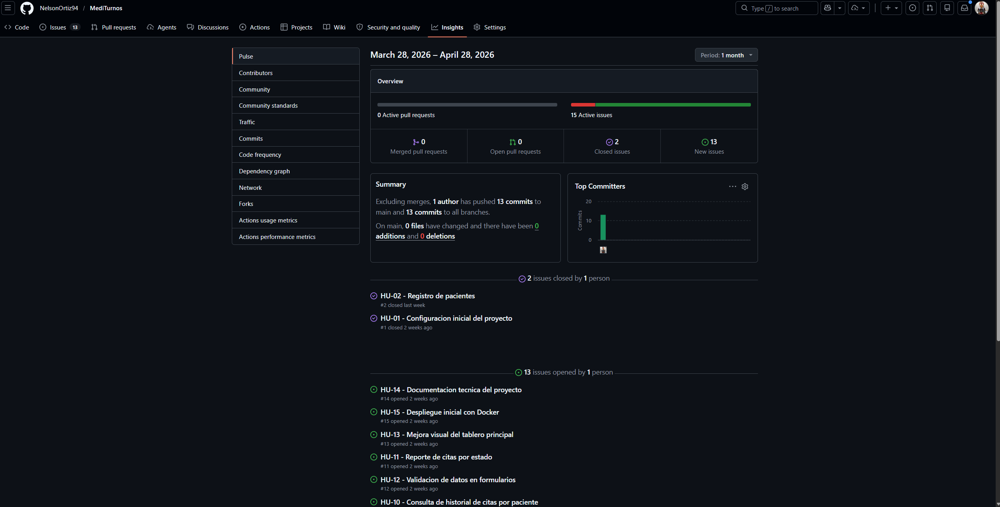
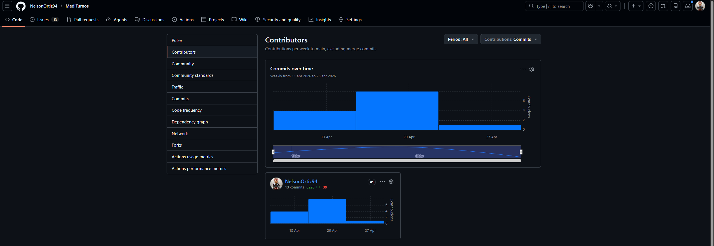
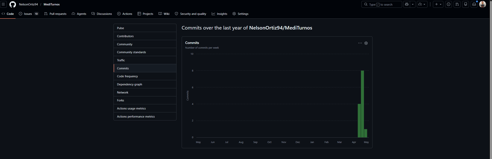
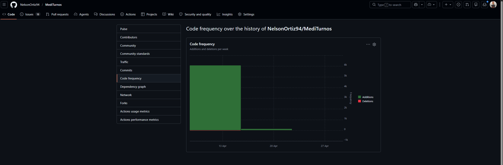

# Informe de Progreso — Sprint 1

## 1. Resumen del Sprint

| Campo | Detalle |
|---|---|
| Fecha de inicio | 21/04/2026 |
| Fecha de fin | 25/04/2026 |
| Issues planificados | 5 |
| Issues completados | 2 (HU-01, HU-02) |
| Issues en revisión | 2 (HU-05, HU-07) |
| Issues en progreso | 3 (HU-03, HU-04, HU-06) |

### Issues del Sprint 1

| Issue | Título | Estado |
|---|---|---|
| #1 | HU-01 — Configuración inicial del proyecto | ✅ Completado |
| #2 | HU-02 — Registro de pacientes | ✅ Completado |
| #3 | HU-03 — Gestión de médicos | 🔄 En Progreso |
| #4 | HU-04 — Gestión de especialidades | 🔄 En Progreso |
| #6 | HU-06 — Agendamiento de citas | 🔄 En Progreso |

---

## 2. Estado del Tablero Kanban

### Distribución de issues tras los movimientos del Sprint 1

| Columna | Issues |
|---|---|
| ✅ Completado | #1 HU-01, #2 HU-02 |
| 🔍 En Revisión | #5 HU-05, #7 HU-07 |
| 🔄 En Progreso | #3 HU-03, #4 HU-04, #6 HU-06 |
| 📋 Backlog | #8 HU-08, #9 HU-09, #10 HU-10, #11 HU-11, #12 HU-12, #13 HU-13, #14 HU-14, #15 HU-15 |

**Descripción:** Al inicio del Sprint 1 todos los issues estaban en Backlog. Durante la simulación del sprint se movieron 5 issues a "En Progreso" (HU-01, HU-02, HU-03, HU-04, HU-06), luego 3 avanzaron a "En Revisión" (HU-05, HU-07 y uno adicional), y finalmente HU-01 y HU-02 llegaron a "Completado" al cumplir todos sus criterios de aceptación.

** Tablero Kanban — Estado final Sprint 1**

> Distribución final: **Backlog** (8 issues: HU-08 a HU-15) · **In Progress** (3 issues: HU-03, HU-04, HU-06) · **In Review** (2 issues: HU-05, HU-07) · **Done** (2 issues: HU-01, HU-02)
> Ver tablero en vivo: https://github.com/users/NelsonOrtiz94/projects/1/views/1

---

## 3. Análisis de GitHub Insights

### 3.1 Pulse

** GitHub Insights — Pulse (último mes)**

**Interpretación:**
El Pulse muestra la actividad del repositorio en el período 28/03/2026 – 28/04/2026. Se registran **13 commits** realizados por 1 autor hacia la rama `main`. Se cerraron **2 issues** (HU-01 y HU-02) y se abrieron **13 issues** nuevos. Hay **0 Pull Requests** (abiertos y mergeados), lo cual es normal en un proyecto individual donde se trabaja directamente sobre la rama principal. Los commits semánticos con prefijos `feat:`, `docs:` y `chore:` son visibles en el resumen de actividad.

### 3.2 Contributors

** GitHub Insights — Contributors**

**Interpretación:**
El único contribuidor es **NelsonOrtiz94** con **13 commits**, **6.228 líneas agregadas** y solo **39 líneas eliminadas**. La gráfica "Commits over time" muestra dos picos: uno en la semana del **13 de abril** (scaffolding inicial: estructura del proyecto, Docker, `pom.xml`) y el pico más alto en la semana del **20 de abril** (implementación de entidades JPA, controladores REST, componentes React). La semana del **27 de abril** registra actividad mínima correspondiente a los commits de documentación e informe. En un equipo real esta vista permitiría detectar si algún desarrollador está sobrecargado o si la distribución de trabajo es inequitativa.

### 3.3 Frecuencia de Commits

**GitHub Insights — Commits over the last year**

**Interpretación:**
La gráfica muestra los commits por semana en el último año. Todo el historial del proyecto está concentrado en **abril 2026**, con un pico de **8 commits** en la semana del 20 de abril (implementación de entidades, servicios y controladores) y **4 commits** en la semana del 13 de abril (scaffolding inicial). Fuera de ese período no hay actividad, lo cual es coherente con ser un proyecto nuevo. En un sprint maduro los commits deberían distribuirse uniformemente cada día de la semana para reflejar un flujo de trabajo continuo y evitar el "efecto avalancha" de último momento.

### 3.4 Code Frequency

**GitHub Insights — Code Frequency**

**Interpretación:**
La gráfica muestra un bloque verde de casi **6.000 líneas agregadas** en la semana del **13 de abril**, correspondiente a la creación de toda la estructura base del proyecto: entidades JPA (`Paciente`, `Medico`, `Especialidad`, `Cita`), repositorios Spring Data, servicios, controladores REST, componentes React y configuración de Docker/PostgreSQL. La semana del **20 de abril** muestra una segunda barra más pequeña con el resto de la implementación. Las líneas eliminadas (rojo) son prácticamente **cero** en todo el historial, lo que confirma que el código fue construido de forma incremental y limpia, sin grandes refactorizaciones. A medida que el proyecto avance hacia las épicas 2 y 3, se esperan ciclos más balanceados de adición y modificación.

---

## 4. Reflexión

**¿Qué te dice el tablero sobre el ritmo de avance del Sprint?**
El tablero muestra que el Sprint 1 tuvo un ritmo positivo en la Épica 1: se completaron exitosamente HU-01 (configuración inicial) y HU-02 (registro de pacientes), que son los cimientos del sistema. Sin embargo, HU-03, HU-04 y HU-06 quedaron en progreso, lo que indica que el alcance del sprint fue ligeramente optimista para el tiempo disponible. Para el Sprint 2 se ajustará la cantidad de issues seleccionados.

**¿Qué harías diferente en el Sprint 2?**
- Seleccionar solo 3 o 4 issues para garantizar que todos lleguen a "Completado".
- Definir criterios de "Listo para revisión" más claros antes de mover un issue a En Revisión.
- Realizar commits diarios en lugar de hacerlos por bloques de funcionalidad, para que la gráfica de Insights refleje un ritmo constante.
- Incluir al menos un issue de deuda técnica o mejora de calidad de código.

**¿Qué limitación encontraste al usar GitHub Insights con un repositorio nuevo o individual?**
La principal limitación es que las gráficas de Insights son más informativas cuando hay varios colaboradores y semanas de historia acumulada. En un repositorio nuevo e individual, la sección Contributors solo muestra un contribuidor y la gráfica de frecuencia de commits tiene muy pocos puntos de datos. Además, Pulse no refleja Pull Requests ni Code Reviews porque el flujo de trabajo es directo a la rama principal. En un equipo real estas métricas serían mucho más ricas y reveladoras.

---

## 5. Evidencia de Issues Cerrados

- [Issue #1 — HU-01: Configuración inicial del proyecto](https://github.com/NelsonOrtiz94/MediTurnos/issues/1) — ✅ Cerrado con comentario técnico
- [Issue #2 — HU-02: Registro de pacientes](https://github.com/NelsonOrtiz94/MediTurnos/issues/2) — ✅ Cerrado con comentario técnico

---

## 6. Video de Avance Sprint 1

[Agregar aquí el enlace al video en YouTube (modo no listado) o Google Drive]

> El video cubre: estado del tablero Kanban, recorrido por GitHub Insights (Pulse y Contributors), y reflexión sobre el avance del Sprint 1.

